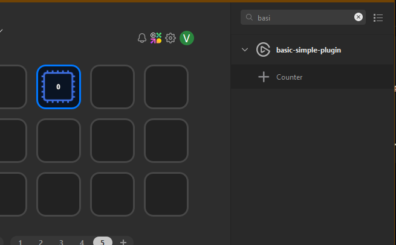
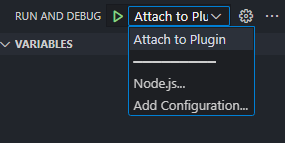
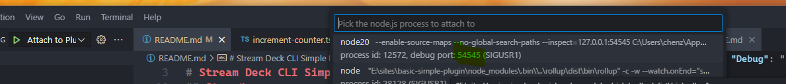
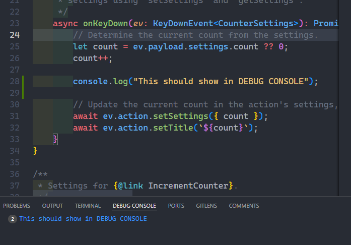

# Stream Deck CLI Simple Plugin

## Step 1:
install CLI from: https://github.com/elgatosf/streamdeck 


## Step 2:
Run this command to use the CLI to create a new plugin:

```bash
streamdeck create
```


## Step 3:
Then to link this to the Stream Deck app - run this command (NOTE: change `com.chenzo.basic-simple-plugin` to whatever your plugin namespace is):

```bash
streamdeck link .\com.chenzo.basic-simple-plugin.sdPlugin\
```

after launching the Stream Deck app, you should see the plugin and the default Counter:




## Step 4:
adjust the Nodejs Debug value in the `manifest.json` file from true to (pick the same port as the next step):

```json
"Nodejs": {
		"Version": "20",
		"Debug": "--inspect=127.0.0.1:54545"
	}
```

## Step 5:

add the following attributes to the `.vscode\launch.json` file:

```json
"address": "127.0.0.1",
"restart": true,
"port": 54545
```

Make sure the port matches the one you picked in Step 4.

## Step 6:
### test debugging:

in a terminal run `npm run watch` 

then in VSCode, press f5 or click the debug icon and select `Attach to Plugin` from the dropdown.



and then when the attach dialog comes up, find the process with same port defined in Step 4 and click on it.



at this point you can hit the counter a couple of times in the Stream Deck and look in the Debug Console and see the console log output from line 28 in `src\actions\increment-counter.ts` 




## Step 7:

change the console.log and save the file and the plugin will automatically reload in the Stream Deck app and also have the debugger re-attach and show the new message in the Debug Console.

